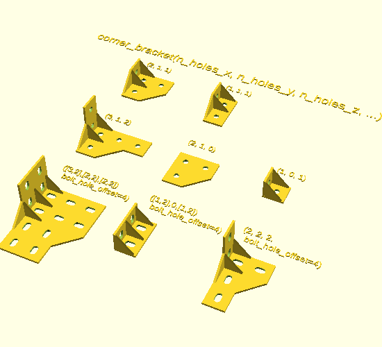
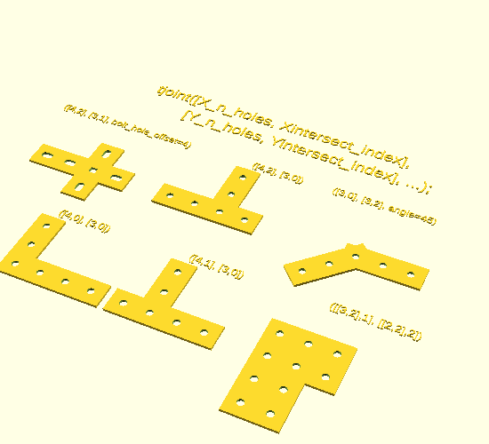
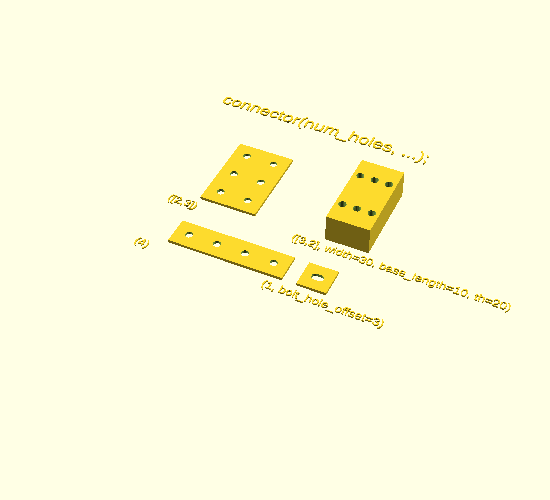
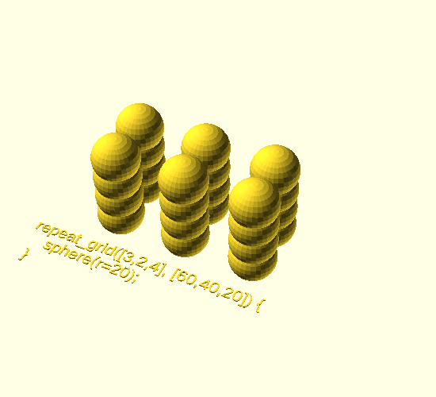

OpenSCAD Connectors
===

A Collection of connectors, mostly geared towards working with 2020
Aluminum extrusions.  This library tries to offer the varieties of basic
bracket, joint or endcap you might need when working with aluminum
extrusions.

On Thingiverse for STL files: https://www.thingiverse.com/thing:2374332

How to use this library:
===

1. clone this repo into your openscad library path
   [OpenScad Wiki explains the library path](https://en.wikibooks.org/wiki/OpenSCAD_User_Manual/Libraries)

        cd <<YOUR_OPENSCAD_LIBRARY_PATH>> ; git clone <<this repo>>

1. Import the relevant code and use it:

        use <OpenSCAD_connectors/corner_bracket.scad>
        corner_bracket(1, 0, 1);

        use <OpenSCAD_connectors/tjoint.scad>
        tjoint([4,2], [3,1]);

        use <OpenSCAD_connectors/connector.scad>
        connector([2,2]);

Goal
===

It is a goal of this project to capture most common scenarios and while
minimizing the number of modules exposed to end users.  A single module, like
"corner_bracket(...)", can create many kinds of corner brackets.

It does not yet cover fancy things like fastening smooth rods to
extrusions or nema motor mounts, but basic t joints and various kinds of corner
brackets are available.

If you have some need that this library does not supply but probably should, I
would love if you open an issue and, if you can, create a PR!

